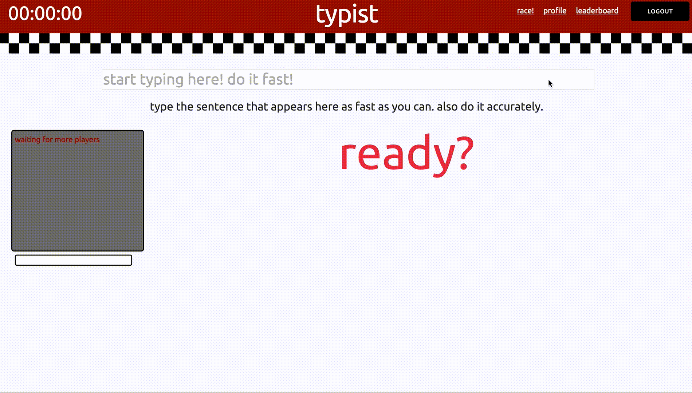
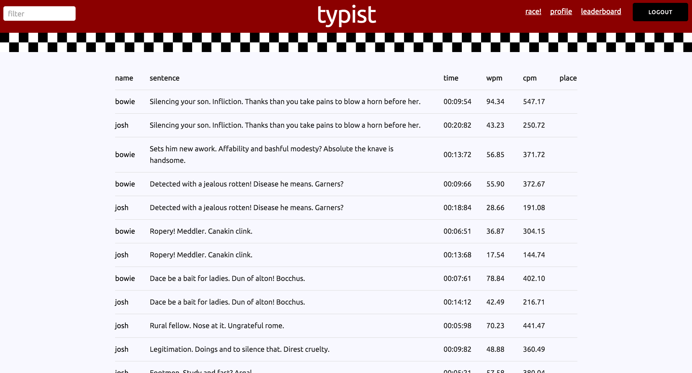
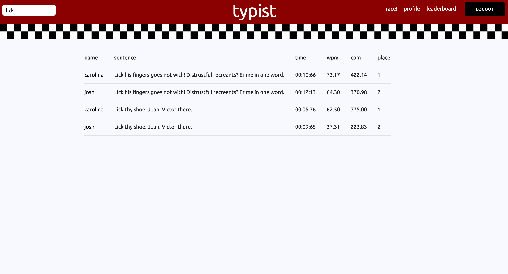
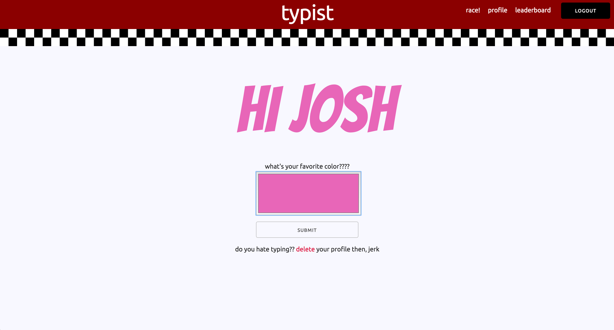
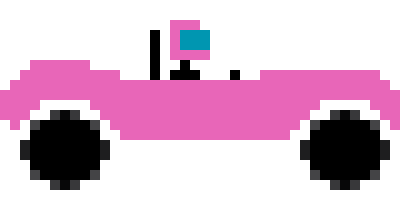

Typist is a multiplayer online racing game built with Express, Mongo, and Socket.io.  The object of the game is to type a random sentence faster than your opponents.  No mistakes allowed.  Also no cheating.  When a race is over, all of the finishers are saved to an open database which anyone can access and discover who is the fastest typist.

# GAMEPLAY!

When a player logs on to the server and clicks ready, they are sent to the next available room.  When there are enough players in a room to have a race, the clock automatically starts counting down, and a sentence appears.  TYPE FASTER!

# SENTENCE!

The sentence is a random sentence that is pulled from the Shake It Speare API, which uses a Markov Model of Shakespeare's body of work to construct hilarious sentences.

# SOCKETS!

The multiplayer aspect of this game was implemented using Socket.io.  As users connect to the server, clicking ready fires a socket.io emit event that tells the server to add that user to a room.  Then when the race starts, there are various socket events emitted to users in that room to update the status of all of the other players in the room.

#  DATABASE!

As soon as a player crosses the finish line, an object is sent to the server with all of the information about the race, and the server saves it to the finishers database.  This database is a publicly accessible

You can also filter out the sentences to find all the ones that contain the word lick.  Uh, I guess you could do other words too.  BUT WHY??

#  PROFILES!

Users create profiles which are used to keep track of their times.  They can also pick their favorite color, and their race car will be painted accordingly.

